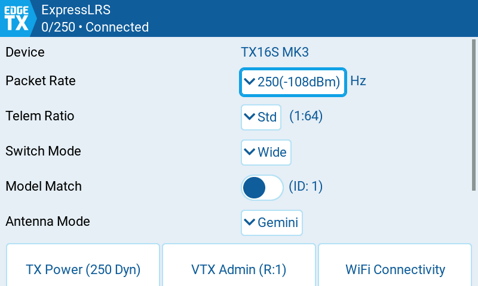
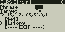
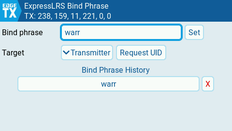
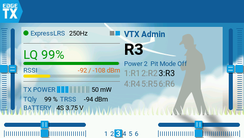
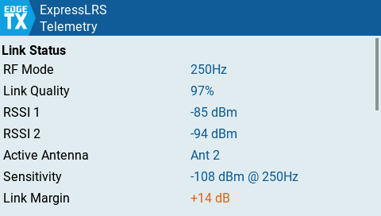
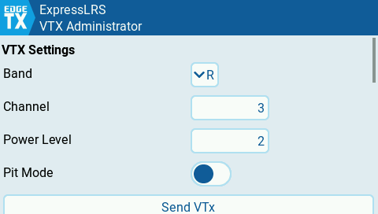

# ExpressLRS Lua Scripts

Lua configuration tool and bind phrase manager for ExpressLRS on EdgeTX radios. Both work on black & white LCD and color LCD radios.

The package also includes two color-LCD widgets: the **ELRS Telemetry Widget** and the **VTX Administrator Widget**.

## Features

- Configure packet rate, telemetry ratio, switch mode, model match, antenna mode, TX power, WiFi connectivity, and more
- Compatible with **ExpressLRS v3.5.4+**

## Installation

Copy the contents of the `src/` directory to the **root** of your radio's SD card, preserving the directory structure. Delete any old ELRS scripts (`ELRS.lua`, `elrsV2.lua`, `elrsV3.lua`, `expresslrs.lua` and their `.luac` counterparts) from `SCRIPTS/TOOLS/`.

When done, your SD card should contain:

```
SCRIPTS/
  ELRS/
    crsf.lua                  -- shared CRSF protocol library
    crsf_params.lua           -- parameter codec (tool, VTX Admin)
    crsf_session.lua          -- stateful parameter client (tool, VTX Admin)
    crsf_elrsinfo.lua         -- TX module info state (telemetry widget)
    msp.lua                   -- MSP-over-CRSF codec (bind tool)
    defer.lua                 -- deferred-callback timer (bind tool)
    ui/
      lcd/
        text_edit.lua         -- BW text editor (bind tool)
    sensors.lua               -- telemetry sensor reader
    file_storage.lua          -- key=value file persistence
    shim.lua                  -- BW compatibility shim
  TOOLS/
    ExpressLRS/
      main.lua                -- entry point
      navigation.lua          -- folder navigation
      ui/
        lvgl.lua              -- color LCD UI (LVGL)
        lcd.lua               -- black & white LCD UI
    ExpressLRSBind/
      main.lua                -- entry point
      history_storage.lua     -- bind phrase history persistence
      ui/
        lvgl.lua              -- color LCD UI (LVGL)
        lcd.lua               -- black & white LCD UI
WIDGETS/
  ELRSTelemetry/
    main.lua
    loadable.lua
    ui/
      ...
  ELRSVTXAdmin/
    main.lua
    loadable.lua
    presets.txt
    ui/
      ...
```

The shared library `SCRIPTS/ELRS/` is required by both tools and both widgets.

### Install with edgetx-cli

You can also install this package using [edgetx-cli](https://github.com/jurgelenas/edgetx-cli):

```sh
edgetx-cli pkg install ExpressLRS/Lua-Scripts
```

Use the `--eject` flag to automatically unmount the SD card after installation.

## ExpressLRS Configuration Tool

The main tool (`SCRIPTS/TOOLS/ExpressLRS/`) lets you configure your ExpressLRS transmitter and receiver settings directly from your radio.

<br/>



## ExpressLRS Bind Phrase Manager

The bind tool (`SCRIPTS/TOOLS/ExpressLRSBind/`) sets the bind phrase -- or a raw UID entered as
comma-separated bytes -- on the transmitter, the receiver, or both in one sequence, reads the
current UID back for verification, and can put the TX in bind mode or unbind a connected receiver.
The last five phrases are kept as a pick-and-send history. Setting the phrase over MSP requires
**ExpressLRS 4.1+** on the device.

<br/>



## Widgets

Both widgets running side-by-side on the home screen:



## ELRS Telemetry Widget

The telemetry widget (`WIDGETS/ELRSTelemetry/`) displays real-time link statistics on your home screen: link quality, RSSI, range, RF mode, TX power, battery voltage, current, GPS, and flight mode. It supports multiple screen resolutions (800x480, 480x320, 480x272, 320x480, 320x240).



## VTX Administrator Widget

The VTX Administrator widget (`WIDGETS/ELRSVTXAdmin/`) provides control over your video transmitter settings -- band, channel, power level, and pit mode -- directly from your radio telemetry screen. It also supports 6POS quick change for rapid VTX channel switching via a 6POS switch. Presets are organised into six collections selected in the widget's editor, so your home field and a race event can each keep their own set of channels.



## Development

See [docs/development.md](docs/development.md) for the tool's internal architecture and the CRSF simulator used for testing inside the EdgeTX simulator.

## Compatibility

| Radio type | Firmware | ExpressLRS |
|------------|----------|------------|
| Black & white LCD | EdgeTX 2.11.6+, 2.12.1+, or 3.0+ | v3.5.4+ |
| Color LCD | EdgeTX 2.11.6+, 2.12.1+, or 3.0+ | v3.5.4+ |

The bind phrase manager additionally requires **ExpressLRS 4.1+** on the device for its MSP
configuration support; on older firmware it reports "No response (needs ELRS 4.1+)".
